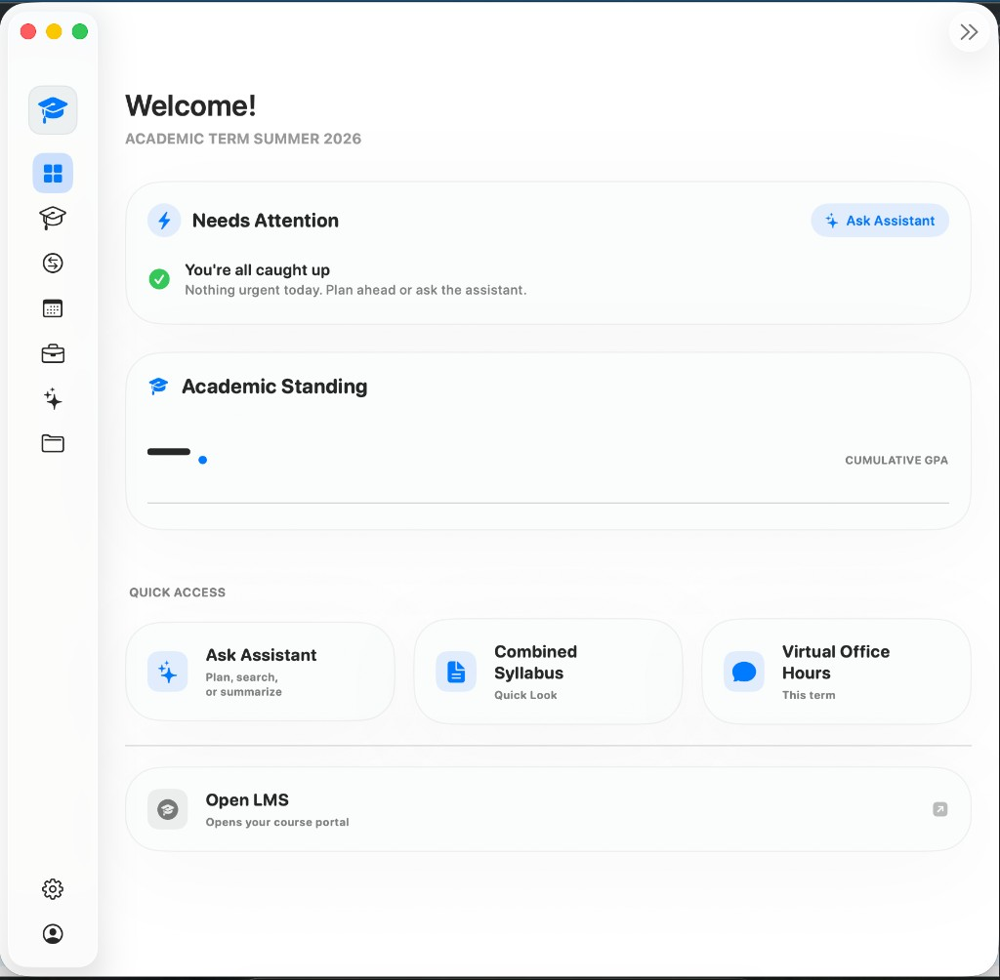
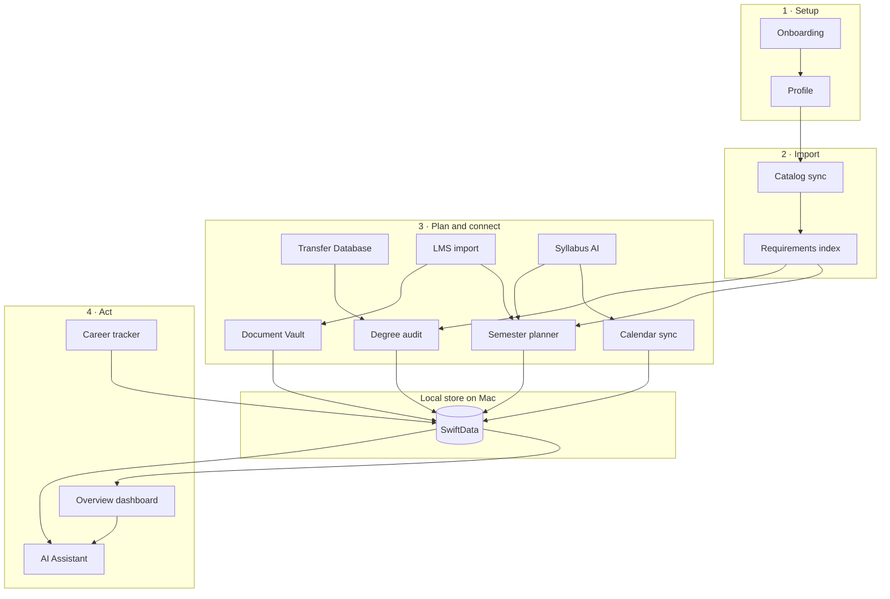
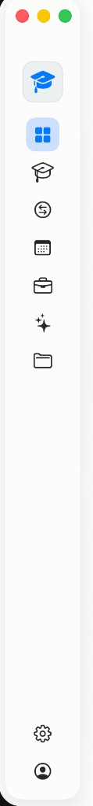
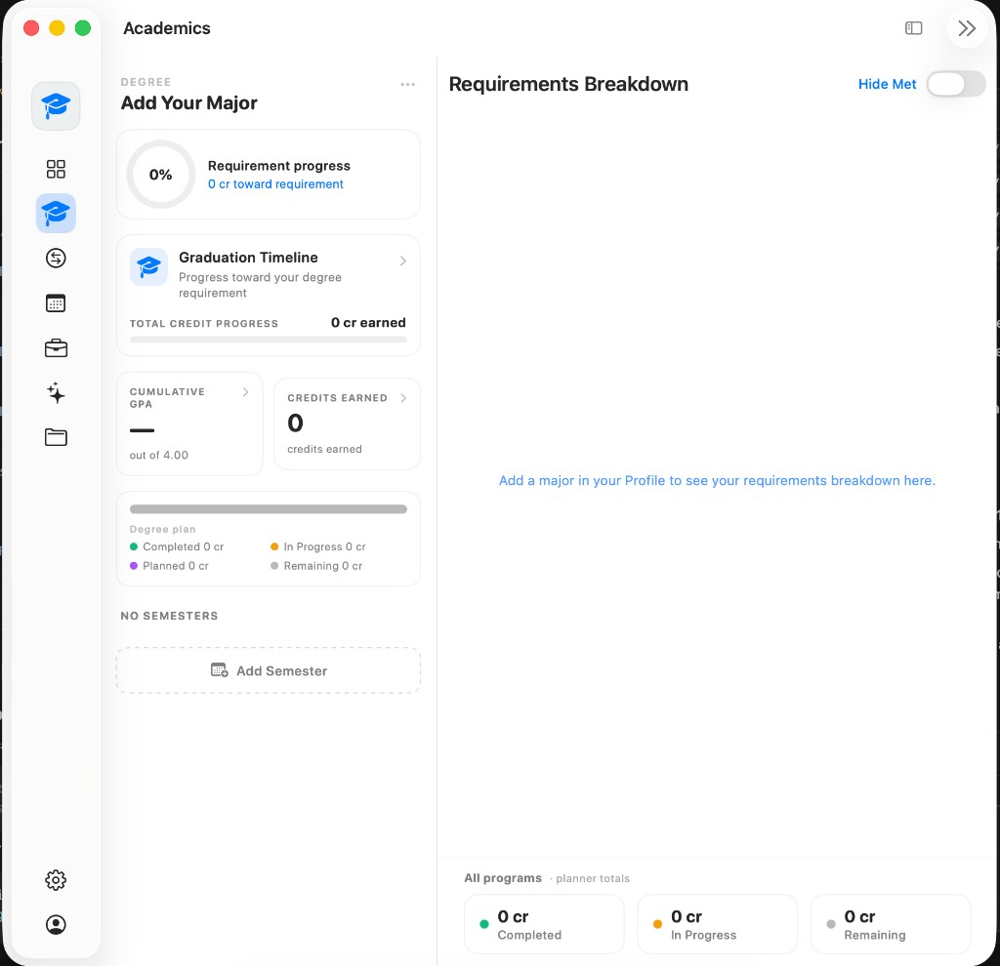
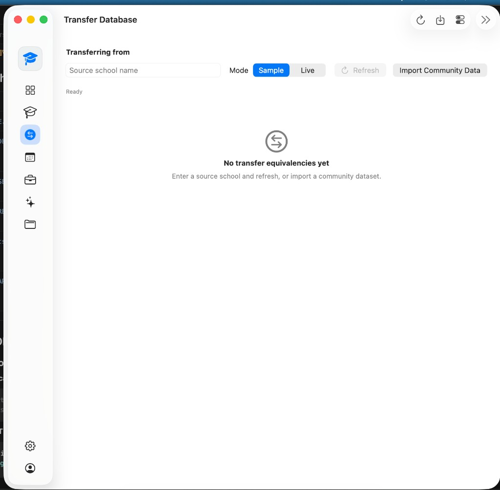
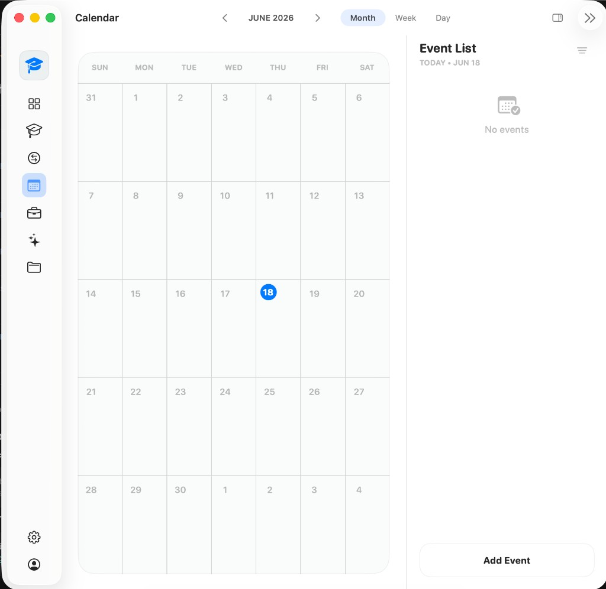
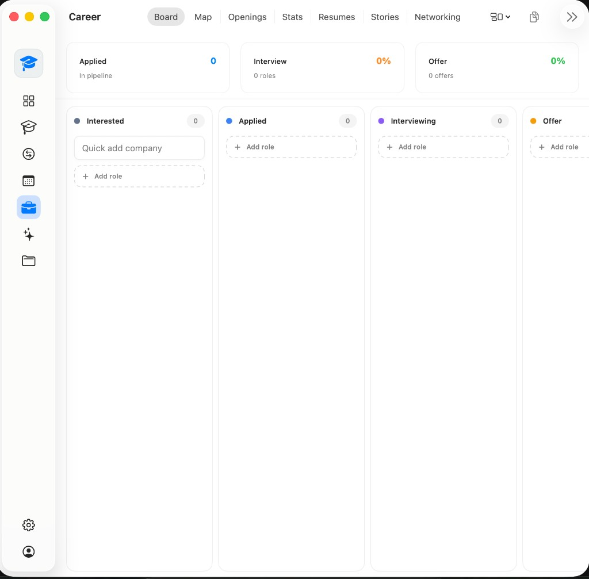
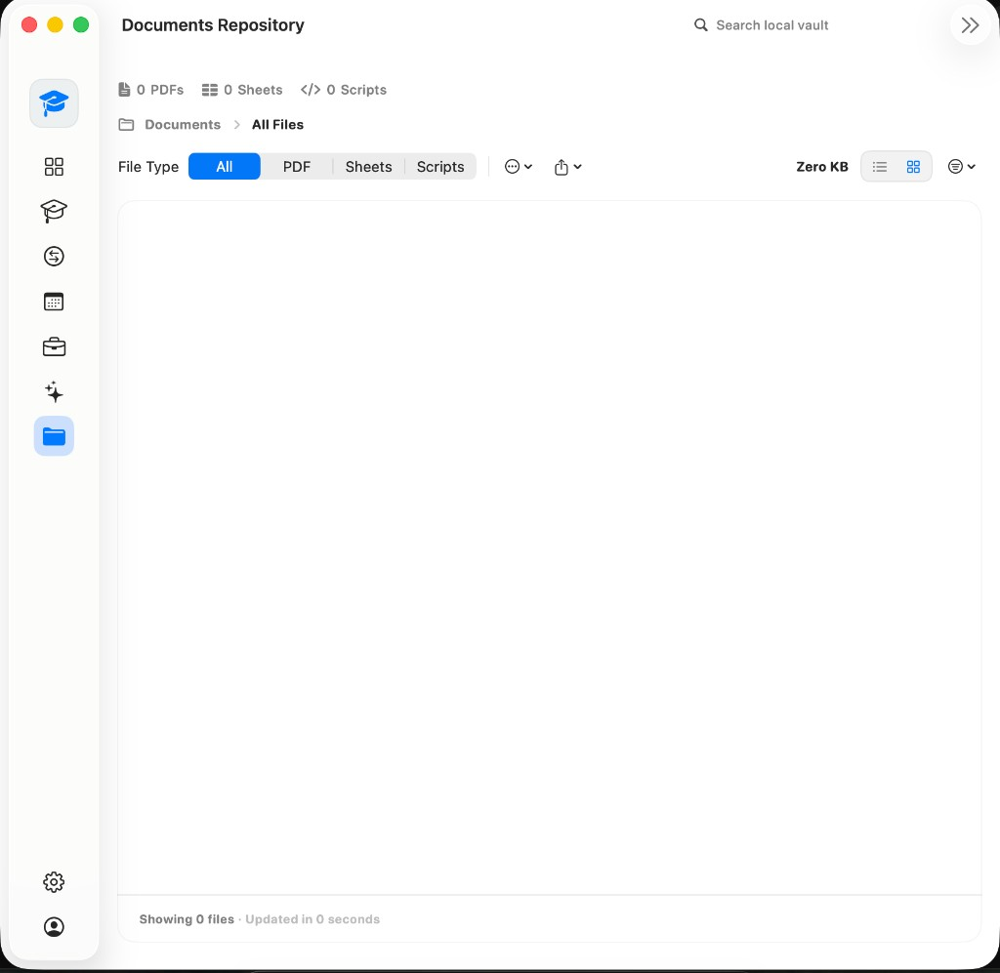
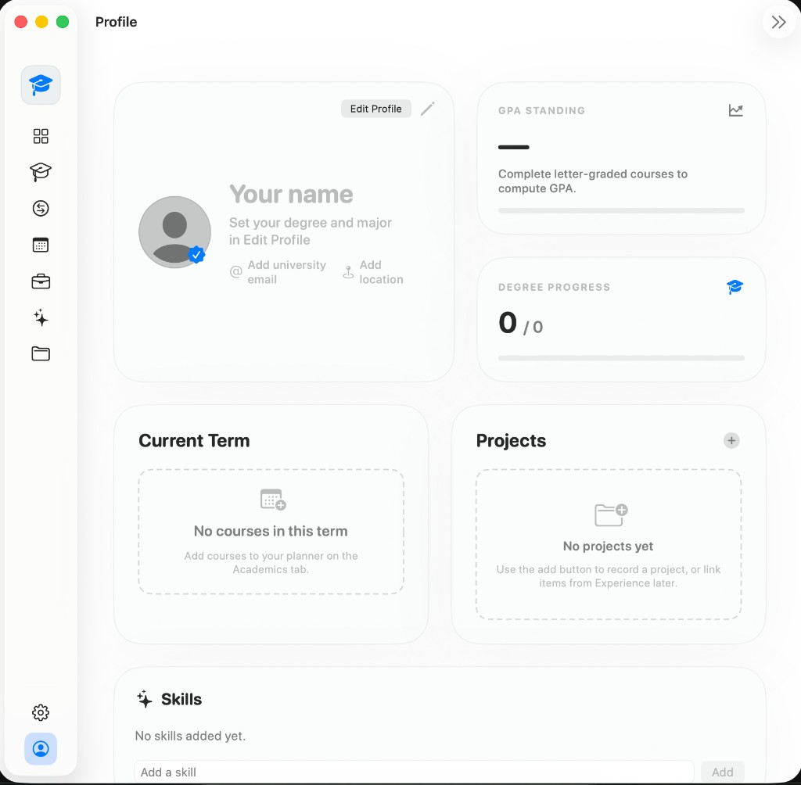
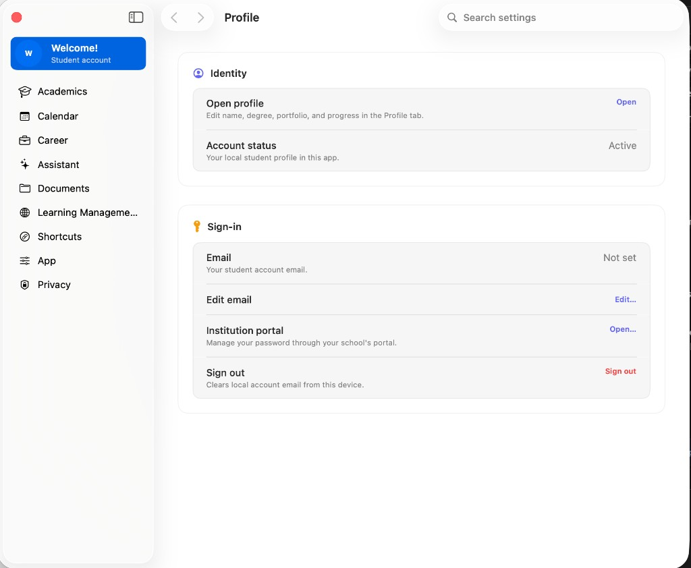

> **Status:** Active development — no public release yet. Contributors can build from source; see [Development Guide](docs/DEVELOPMENT.md).

  

<h1 align="center">Blueprint</h1>

<em>One Mac app for your whole semester — plan your degree, track applications, sync your calendar, and keep documents in one local workspace.</em>

  Set up your workspace once in a guided onboarding flow — refine everything later in Profile and Settings.

  Built with <strong>Swift 6</strong>, <strong>SwiftUI</strong>, <strong>SwiftData</strong>, on-device <strong>MLX</strong>, and an optional <strong>Rust/Typst</strong> resume PDF bridge.

  
  
  
  
  

  

---

## The problem

College students juggle degree planning, class schedules, job searches, and scattered files across registrar sites, LMS portals, calendars, and job boards. Blueprint brings those workflows into one local workspace on your Mac.

| Problem | Blueprint's answer |
|---------|------------------|
| "What do I need to do today?" spans LMS, calendar, and job apps | Overview dashboard with Needs Attention, widgets, and menu bar summary |
| Degree progress is buried in registrar PDFs and bulletin sites | School catalog sync + live degree audit + semester planner |
| Career search is fragmented (boards, ATS, resumes, networking) | Career workspace: tracker, job scrapers, resume builder, nearby employers |
| Student data is scattered and often cloud-dependent | Local SwiftData store, Document Vault, optional Touch ID lock |
| Transfer credit is opaque and hard to map to requirements | Transfer Database with equivalency lookup and degree impact |

*Set up your workspace once — plan, track, and act from one Mac app.*

---

## How it works

Blueprint is built around a single local workspace on your Mac. A guided **onboarding wizard** is your first experience — school, degrees, and integrations in one pass. After that, the app pulls in official catalog data, connects external tools, and keeps academic, calendar, career, and document state in sync.

| When you… | Blueprint… |
|-----------|----------|
| Declare a major in Profile | Pulls requirement blocks from the synced catalog and shows live progress in Academics |
| Drag a course onto a semester | Updates the planner, recalculates audit completion, and reflects credit counts on Overview |
| Import a syllabus PDF | Extracts deadlines and grading weights, proposes calendar events, and links them to the planned course |
| Add a transfer equivalency | Scores how those credits count toward your active degree requirements |
| Track a job application | Surfaces pipeline stats on Overview and lets the Assistant compare your resume to the posting |
| Ask the Assistant to draft a schedule | Reads audit gaps, prerequisites, and calendar conflicts — then proposes planner changes for you to confirm |

1. **Set up your workspace** — Onboarding captures school, degrees, majors/minors, optional transfer history, LMS choice, and dashboard widgets. Profile becomes the source of truth.
2. **Import the official catalog** — Scrapes or imports your school's public bulletin (Modern Campus, CourseLeaf, Acalog, etc.), indexes programs and requirements, and builds a searchable catalog and vector index.
3. **Plan and connect** — Semester planner, calendar sync, LMS import, Syllabus AI, and Transfer Database all write to the same local store.
4. **See what's urgent and act** — Overview aggregates urgency; the Assistant reads across domains on-device, with opt-in web search.

> Everything above runs against a **local SwiftData store on your Mac**. Network access is limited to features you turn on: catalog fetch, calendar OAuth, LMS browsing, job board scraping, or opt-in Assistant web search.

For module boundaries and repository layout, see [docs/ARCHITECTURE.md](docs/ARCHITECTURE.md).

---

## What Blueprint does

  

### Overview

  

- GPA and credit progress rings, configurable dashboard widgets, and a getting-started checklist
- **Needs Attention** strip answers "what do I need to do today?" across academics, calendar, and career
- Quick actions: Ask Assistant, Combined Syllabus, Open LMS

### Academics

  

- Multi-semester planner with drag-and-drop course placement
- Live degree audit panel with requirement breakdown and specialization support
- Graduation timeline configuration and cumulative GPA / credits detail

### Transfer Database

  

- Source-to-target equivalency lookup from official and community datasets
- Projected degree impact against your declared programs

### Calendar

  

- Unified calendar grid with Google, Apple, iCloud, and Outlook sync
- ICS subscriptions, course-linked events, and focus blocks

### Career

  

- Application tracker (kanban and list), scraped job board openings, and follow-up reminders
- Resume builder with ATS match scoring, employer map, interview prep, and networking tracker

### AI Assistant

- On-device LLM with Academic Advisor and Financial Aid personas
- Tool-calling across planner, calendar, vault, and career — with optional web search

<strong>Documents, Profile, Settings, and more</strong>

**Documents (Vault)**

  

- Encrypted local vault, Spotlight search, auto-classification, watched-folder ingest, semester archive, PDF annotation

**Profile**

  

- Multi-degree identity, experience and achievements, portfolio projects, and skills

**Settings**

  

- Catalog sync, integrations, privacy controls, and diagnostics export

**Also included**

- **LMS** — Embedded Brightspace/Canvas/Moodle portal with assignment import and vault downloads
- **Syllabus AI** — Extract deadlines and grading from syllabi, review calendar conflicts, persist to course records
- **Platform extras** — Menu bar extra, deep links (`college://`), Ask Blueprint sheet (⌘⇧K)

---

## Privacy & trust

- **Stored on this Mac** — profile, grades, course plans, vault files, and conversations
- **Network only when you use it** — calendar OAuth, catalog fetch, LMS browsing, job scraping, or opt-in Assistant web search
- **Guidance, not authority** — the Assistant helps interpret policy but is not the registrar or financial aid office

*Full details in-app → Settings → Privacy & Data*

---

## Roadmap

**Completed**
- [x] Multi-tab student workspace (Overview, Academics, Calendar, Career, Assistant, Documents)
- [x] School catalog sync and degree audit
- [x] On-device Assistant with planner tools
- [x] Document Vault with Spotlight indexing
- [x] Transfer Database with degree impact scoring

**Up next**
- [ ] At-rest field encryption (UI exists; disabled for current release — [ADR 008](docs/adr/008-encryption-ship-posture.md))
- [ ] Rust/Typst resume PDFs (optional bridge; CoreText fallback — [ADR 009](docs/adr/009-rust-typst-ship-posture.md))
- [ ] Catalog MLX embeddings (Phase 0; lexical fallback today)
- [ ] Expanded school parser coverage
- [ ] On-device translation (Phase 12 v1)
- [ ] Performance monitoring dashboard with nightly CI health checks

---

## Requirements

- macOS 15+ · Apple Silicon (M-series) only · Xcode 16+ for contributors
- **Want to build it?** → [Development Guide](docs/DEVELOPMENT.md)

---

## Contributing

Issues and PRs welcome. Clone the repo and follow the [Development Guide](docs/DEVELOPMENT.md) to build and run tests locally.

---

## Repository guide

Every path tracked in git is documented in [docs/REPOSITORY.md](docs/REPOSITORY.md) — what it does and why it exists.

| Area | What's documented |
|------|-------------------|
| Root configs | `.gitignore`, `Config.xcconfig`, `Secrets.xcconfig.example`, etc. |
| App source | `College/` — grouped by folder; each file listed with purpose |
| Tests | `CollegeTests/`, `CollegeUITests/` — mirrors production features |
| Packages | `Packages/CollegeCalendar`, `CollegeCareer`, `CollegeAcademics`, `CollegePlatformBoundary` |
| CI | `.github/workflows/*.yml` — what each workflow gates |
| Scripts | `scripts/*` — build, test, catalog, and maintenance tooling |
| Docs | `docs/**` — architecture, ADRs, sign-off checklists, archives |
| Extensions | `CollegeShareExtension/`, `VecturaService/`, `Inspection` |

For module-level architecture, see [docs/ARCHITECTURE.md](docs/ARCHITECTURE.md).

---

## License

MIT — see [LICENSE](LICENSE). Project source code is MIT-licensed; bundled third-party assets (MLX models, fonts, catalog data) remain under their own terms.

---

Built by Timothy Leung

[Development guide](docs/DEVELOPMENT.md) · [Architecture](docs/ARCHITECTURE.md) · [ADRs](docs/adr/) · [License](LICENSE)
