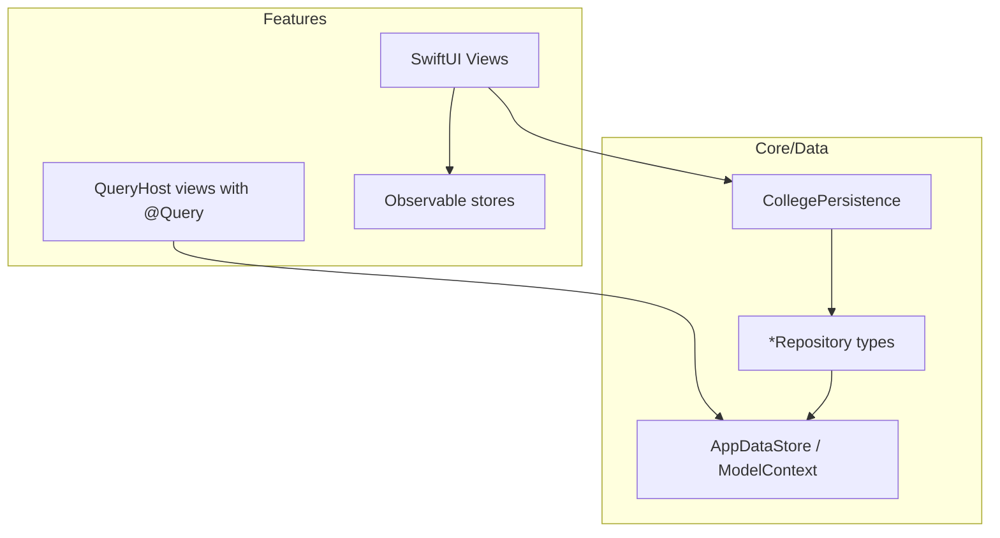

# College — Architecture

Technology-neutral map of the macOS SwiftUI app after the feature-first reorg (2026-06).

## Principles

- **One product area → one `Features/<Name>/` folder** — views, stores, feature services, and query hosts for that tab live together.
- **Shared persistence → `Core/Data/`** — `@Model` schema, `CollegePersistence`, repositories, and sync adapters used by multiple features.
- **Cross-cutting infra → `Core/`** — design system, platform, security, shared services.
- **Naming** — technology-neutral persistence labels everywhere except the required framework import and API surface.

## Top-level tree

```
College/
  App/                    Launch, ContentView, sidebar, onboarding, menu bar, coordinators
  Features/
    Assistant/            AI assistant (was Intelligence/)
    Overview/             Dashboard + widgets + WidgetKit
    Academics/            Audit, GPA, requirement views
    Calendar/             Grid, sync, ICS
    Career/               Applications, Workday board
    Catalog/              Scrape, ingest, vector index (+ CatalogEmbed/)
    Courses/              Course dashboard, search, GPA popover
    Documents/            Vault UI
    Profile/              Identity, experience, achievements
    Degree/               Degree planner UI (+ MajorMinorDetailsView)
    Settings/             Preferences, catalog sync settings
    SyllabusAI/           Syllabus review flows
    Brightspace/          LMS import
  Core/
    Data/
      Persistence/        CollegePersistence + extensions
      Repositories/       Profile, Calendar, Career, Catalog, Vault repositories
      Storage/            AppDataStore, schema, migrations, query hosts, sync mirrors
    Services/             Auth, cloud, vault helpers, catalog background sync
    DesignSystem/         Shared UI tokens and chrome
    Platform/             Focus blocks, intelligence helpers
    Security/             Lock, privacy, data wipe
    Utilities/            Shared helpers
    Location/             Location permission service
    Notifications/        Academic notification scheduler
    WebShortcuts/         Shortcut web coordinator
  Debug/                  DEBUG-only diagnostics
  Resources/              Localizable.xcstrings (at College root)
```

## Data flow



- **`CollegePersistence`** — `@MainActor` `ObservableObject` injected via `.environmentObject(collegePersistence)` from `CollegeApp` / `ContentView`.
- **Repositories** — CRUD and queries on `ModelContext`; feature code calls through `CollegePersistence` or read bridges/services.
- **`*QueryHost`** — SwiftUI `View` wrappers that host `@Query` for cache invalidation (Calendar, Overview, Career, Profile planner).

## Tests

```
CollegeTests/
  Features/               Mirror production (Assistant, Catalog, Calendar, …)
  Persistence/            Schema, harness, integration tests
  Performance/            Launch + baseline acceptance tests
  Core/                   Cross-cutting regression (Core Swift, UserDefaults cleanup)
  Support/                Shared helpers (TestFixturePaths, live-network opt-in)
  Fixtures/               CourseLeaf XML/JSON and ingest fixtures
```

Run gates:

```bash
./scripts/check-neutral-persistence-labels.sh
./scripts/run-performance-gates.sh
xcodebuild test -scheme College -destination 'platform=macOS'
```

## Related docs

- [`docs/post-migration-ui-checklist.md`](post-migration-ui-checklist.md) — manual UI verification
- [`docs/phase6-signoff-checklist.md`](phase6-signoff-checklist.md) — release sign-off
- [`docs/reorg-move-map.csv`](reorg-move-map.csv) — mechanical path map used during reorg
- [`docs/archive/`](archive/) — superseded migration and audit notes

## Superseded

- `APP_PATH_MAP.md` — referenced deleted legacy persistence stack; archived to `docs/archive/`.
