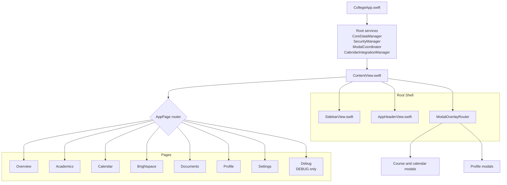

# College App Path Map

This file documents how the app connects from launch to each major section, what the primary UI files do, and which files look unused or kept only for compatibility.

## Launch Path

## Root Shell

- [CollegeApp.swift](College/App/CollegeApp.swift) creates the shared services, wires environment objects into the scene, starts background jobs, and handles macOS appearance and external URL callbacks.
- [ContentView.swift](College/App/ContentView.swift) is the root UI shell that switches pages, applies the lock/unlock flow, and routes all modal overlays.
- [SidebarView.swift](College/App/SidebarView.swift) switches pages by setting `activePage`.
- [AppHeaderView.swift](College/App/AppHeaderView.swift) renders the top bar, with Brightspace-specific controls when that page is active.
- [ModalCoordinator.swift](College/App/ModalCoordinator.swift) stores the shared modal state and defines the modal cases used by the overlay router.
- [MainContentSignals.swift](College/App/MainContentSignals.swift) coordinates the post-unlock render handshake.

## Core Data And State

- [PersistenceController.swift](College/CoreData/PersistenceController.swift) creates and configures the Core Data stack.
- [CoreDataManager.swift](College/CoreData/CoreDataManager.swift) is the app's main data service; it reads, writes, searches, and mutates the persistent model.
- [Models.swift](College/CoreData/Models.swift) contains the Core Data entity definitions and generated model helpers.
- [AppBackupManager.swift](College/CoreData/AppBackupManager.swift) handles persistence backups and restore-related flows.
- [ProfileEntity+Extensions.swift](College/CoreData/ProfileEntity+Extensions.swift) adds convenience accessors and computed behavior to the profile entity.
- [StringNormalization.swift](College/CoreData/StringNormalization.swift) centralizes text cleanup and matching normalization.

## UI Entry Points

- [AddCourseView.swift](College/Courses/AddCourseView.swift) is the legacy course edit/add form with a custom sheet-style layout, text fields, and dropdowns.
- [GenEdAddCourseModal.swift](College/Courses/GenEdAddCourseModal.swift) is the active macOS-native catalog picker sheet that uses `NavigationStack`, `List(selection:)`, `.searchable`, and keyboard shortcuts.
- [CourseSearchView.swift](College/Courses/CourseSearchView.swift) is the older custom search/add flow for adding a catalog course inside a semester.
- [CourseDashboardView.swift](College/Courses/CourseDashboardView.swift) shows course-specific details and secondary actions.
- [EditCourseDetailsView.swift](College/Courses/EditCourseDetailsView.swift) edits a course's details after it has already been created.
- [AddSemesterView.swift](College/Courses/AddSemesterView.swift) creates a new semester entry.

## Courses Folder

- [AddCourseView.swift](College/Courses/AddCourseView.swift) is the full-screen style course editor for a semester, including manual course metadata entry and file import support.
- [GenEdAddCourseModal.swift](College/Courses/GenEdAddCourseModal.swift) is the native sheet for browsing catalog data and attaching a selected course to a semester or as a GenEd course.
- [CourseSearchView.swift](College/Courses/CourseSearchView.swift) is the older custom catalog search experience that predates the native sheet rewrite.
- [CourseDashboardView.swift](College/Courses/CourseDashboardView.swift) shows one course's summary, enrollment-related actions, and supporting content.
- [EditCourseDetailsView.swift](College/Courses/EditCourseDetailsView.swift) edits the stored course record after creation.
- [AddSemesterView.swift](College/Courses/AddSemesterView.swift) creates semester records.
- [GPACalculatorPopoverView.swift](College/Courses/GPACalculatorPopoverView.swift) provides the GPA calculator popover used by course-related workflows.
- [CourseCatalogService.swift](College/Courses/CourseCatalogService.swift) encapsulates catalog lookup and import logic.
- [CourseCatalogManagerView.swift](College/Courses/CourseCatalogManagerView.swift) is the admin catalog management UI.
- [CourseCatalogEntity+Display.swift](College/Courses/CourseCatalogEntity+Display.swift) adds display formatting helpers for catalog rows and badges.

## Section Paths

### Overview page

- Entry: [OverviewView.swift](College/Overview/OverviewView.swift)
- Reads: Core Data profile and upcoming calendar events
- Writes: opens catalog-add modals through `ModalCoordinator`
- Supporting files: [Models.swift](College/CoreData/Models.swift), [CoreDataManager.swift](College/CoreData/CoreDataManager.swift)

### Academics page

- Entry: [AcademicsView.swift](College/Academics/AcademicsView.swift)
- Reads: profile, semesters, courses, degree requirements
- Supporting UI: `LandscapeDashboard`, `AcademicsAuditPanel`, and `RequirementsBreakdownView` are all defined in the same file
- Modal links: add semester, add catalog course, course dashboard, edit course details
- Supporting files: [AddSemesterView.swift](College/Courses/AddSemesterView.swift), [GenEdAddCourseModal.swift](College/Courses/GenEdAddCourseModal.swift), [CourseDashboardView.swift](College/Courses/CourseDashboardView.swift), [EditCourseDetailsView.swift](College/Courses/EditCourseDetailsView.swift)

### Calendar page

- Entry: [CalendarView.swift](College/Calendar/CalendarView.swift)
- Reads: `CalendarEventEntity` and `TaskEntity`
- Integrations: [CalendarIntegrationManager.swift](College/Calendar/CalendarIntegrationManager.swift), [AppleCalendarIntegration.swift](College/Calendar/AppleCalendarIntegration.swift), [CalendarCourseLinker.swift](College/Calendar/CalendarCourseLinker.swift), [CalendarReminderScheduler.swift](College/Calendar/CalendarReminderScheduler.swift)
- Modals: add/edit calendar items and tasks are routed through `ModalCoordinator`

### Calendar Folder

- [CalendarView.swift](College/Calendar/CalendarView.swift) renders the month/week event surface and the task list.
- [AddCalendarItemOverlay.swift](College/Calendar/AddCalendarItemOverlay.swift) is the full-screen style event editor.
- [AddTaskOverlay.swift](College/Calendar/AddTaskOverlay.swift) creates and edits tasks.
- [CalendarIntegrationManager.swift](College/Calendar/CalendarIntegrationManager.swift) coordinates calendar authorization and event syncing.
- [AppleCalendarIntegration.swift](College/Calendar/AppleCalendarIntegration.swift) bridges to the native Apple Calendar APIs.
- [CalendarCourseLinker.swift](College/Calendar/CalendarCourseLinker.swift) links events to courses by scanning titles and metadata.
- [CalendarReminderScheduler.swift](College/Calendar/CalendarReminderScheduler.swift) schedules notifications for calendar reminders.
- [CalendarTimeZonePreference.swift](College/Calendar/CalendarTimeZonePreference.swift) stores and resolves the preferred calendar time zone.
- [EventColorOverrides.swift](College/Calendar/EventColorOverrides.swift) holds display color overrides for calendar items.
- [CalendarEditorNotifications.swift](College/Calendar/CalendarEditorNotifications.swift) coordinates editor-related notification events.
- [NewEventModal.swift](College/Calendar/NewEventModal.swift) is a newer event creation modal used by calendar workflows.

### Brightspace page

- Entry: [BrightspaceView.swift](College/Brightspace/BrightspaceView.swift)
- Owns: [BrightspaceWebCoordinator.swift](College/Brightspace/BrightspaceWebCoordinator.swift)
- Related files: [BrightspaceImportSheet.swift](College/Brightspace/BrightspaceImportSheet.swift), [BrightspaceDownloadManager.swift](College/Brightspace/BrightspaceDownloadManager.swift), [BrightspaceKeychainService.swift](College/Brightspace/BrightspaceKeychainService.swift)

### Brightspace Folder

- [BrightspaceView.swift](College/Brightspace/BrightspaceView.swift) hosts the Brightspace web experience inside the app.
- [BrightspaceWebCoordinator.swift](College/Brightspace/BrightspaceWebCoordinator.swift) manages navigation, page state, and communication with the web view.
- [BrightspaceImportSheet.swift](College/Brightspace/BrightspaceImportSheet.swift) handles importing Brightspace content into the app.
- [BrightspaceDownloadManager.swift](College/Brightspace/BrightspaceDownloadManager.swift) manages file downloads from Brightspace.
- [BrightspaceKeychainService.swift](College/Brightspace/BrightspaceKeychainService.swift) stores credentials and tokens in the keychain.

### Documents page

- Entry: [DocumentsView.swift](College/Documents/DocumentsView.swift)
- Current state: mostly static/mock presentation in the UI layer
- Real vault support: [VaultDocumentService.swift](College/Services/VaultDocumentService.swift), [VaultFileOrganizer.swift](College/Services/VaultFileOrganizer.swift), [FSWatchdogService.swift](College/Services/FSWatchdogService.swift), [StaleFileMonitor.swift](College/Services/StaleFileMonitor.swift), [VaultWeeklyDigest.swift](College/Services/VaultWeeklyDigest.swift), [VaultSemesterArchive.swift](College/Services/VaultSemesterArchive.swift), [VaultScreenshotTriage.swift](College/Services/VaultScreenshotTriage.swift), [VaultStorageAnalytics.swift](College/Services/VaultStorageAnalytics.swift), [VaultSummaryService.swift](College/Services/VaultSummaryService.swift)

### Documents And Vault Services

- [DocumentsView.swift](College/Documents/DocumentsView.swift) renders the user-facing documents screen.
- [VaultDocumentService.swift](College/Services/VaultDocumentService.swift) is the main document vault service.
- [VaultFileOrganizer.swift](College/Services/VaultFileOrganizer.swift) organizes files into vault structure.
- [FSWatchdogService.swift](College/Services/FSWatchdogService.swift) watches the file system for changes.
- [StaleFileMonitor.swift](College/Services/StaleFileMonitor.swift) flags stale or abandoned files.
- [VaultWeeklyDigest.swift](College/Services/VaultWeeklyDigest.swift) generates a weekly summary of vault activity.
- [VaultSemesterArchive.swift](College/Services/VaultSemesterArchive.swift) archives semester documents.
- [VaultScreenshotTriage.swift](College/Services/VaultScreenshotTriage.swift) triages screenshots for filing.
- [VaultStorageAnalytics.swift](College/Services/VaultStorageAnalytics.swift) tracks storage usage and trends.
- [VaultSummaryService.swift](College/Services/VaultSummaryService.swift) generates vault summary text and metadata.
- [VaultDuplicateDetector.swift](College/Services/VaultDuplicateDetector.swift) looks for duplicate files.
- [VaultShareBundleService.swift](College/Services/VaultShareBundleService.swift) packages content for sharing.
- [VaultUploadSheet.swift](College/Services/VaultUploadSheet.swift) is the upload UI for vault ingestion.
- [PDFAnnotationView.swift](College/Services/PDFAnnotationView.swift) presents PDF annotation controls.
- [DocumentClassifierService.swift](College/Services/DocumentClassifierService.swift) categorizes documents before they are stored.

### Profile page

- Entry: [ProfileView.swift](College/Profile/ProfileView.swift)
- Subviews: [AcademicIdentityView.swift](College/Profile/AcademicIdentityView.swift), [ExperienceView.swift](College/Profile/ExperienceView.swift), [AchievementsView.swift](College/Profile/AchievementsView.swift), [AdvisorMeetingPrepView.swift](College/Profile/AdvisorMeetingPrepView.swift)
- Uses: Core Data profile plus semester history

### Profile Folder

- [ProfileView.swift](College/Profile/ProfileView.swift) is the main profile hub.
- [AcademicIdentityView.swift](College/Profile/AcademicIdentityView.swift) displays identity and academic summary details.
- [ExperienceView.swift](College/Profile/ExperienceView.swift) manages experiences and work history.
- [AchievementsView.swift](College/Profile/AchievementsView.swift) manages awards and accomplishments.
- [AdvisorMeetingPrepView.swift](College/Profile/AdvisorMeetingPrepView.swift) prepares data for advisor meetings.

### Settings page

- Entry: [SettingsView.swift](College/Settings/SettingsView.swift)
- Panels: [SettingsPanels_General.swift](College/Settings/SettingsPanels_General.swift), [SettingsPanels_Appearance.swift](College/Settings/SettingsPanels_Appearance.swift), [SettingsPanels_Calendar.swift](College/Settings/SettingsPanels_Calendar.swift), [SettingsPanels_Services.swift](College/Settings/SettingsPanels_Services.swift), [WatchdogSettingsPanel.swift](College/Settings/WatchdogSettingsPanel.swift)
- Also defined in [SettingsView.swift](College/Settings/SettingsView.swift): `SettingsBrightspacePanel`

### Settings Folder

- [SettingsView.swift](College/Settings/SettingsView.swift) hosts the settings shell.
- [SettingsPanels_General.swift](College/Settings/SettingsPanels_General.swift) contains general app preferences.
- [SettingsPanels_Appearance.swift](College/Settings/SettingsPanels_Appearance.swift) controls visual appearance.
- [SettingsPanels_Calendar.swift](College/Settings/SettingsPanels_Calendar.swift) contains calendar-related preferences.
- [SettingsPanels_Services.swift](College/Settings/SettingsPanels_Services.swift) configures external integrations and services.
- [WatchdogSettingsPanel.swift](College/Settings/WatchdogSettingsPanel.swift) controls file watchdog behavior.

### Debug page

- Runtime debug files: [AppLogger.swift](College/Debug/AppLogger.swift), [DebugLogger.swift](College/Debug/DebugLogger.swift), [UnlockDebugLog.swift](College/Debug/UnlockDebugLog.swift), [AppLogsView.swift](College/Debug/AppLogsView.swift), [ErrorReportView.swift](College/Debug/ErrorReportView.swift), [PerformanceMonitor.swift](College/Debug/PerformanceMonitor.swift), [GoogleDebugLog.swift](College/Debug/GoogleDebugLog.swift)
- `IntelligenceDebugView` is reachable only in DEBUG builds through the root router

### Security Folder

- [SecurityManager.swift](College/Security/SecurityManager.swift) manages app lock state and unlock gating.
- [UnlockView.swift](College/Security/UnlockView.swift) is the lock screen shown when the app is gated.
- [PrivacyOverviewView.swift](College/Security/PrivacyOverviewView.swift) explains the app's privacy posture.
- [DataWipeManager.swift](College/Security/DataWipeManager.swift) handles destructive data removal flows.

## Shared Infrastructure

- Persistence: [PersistenceController.swift](College/CoreData/PersistenceController.swift), [CoreDataManager.swift](College/CoreData/CoreDataManager.swift), [Models.swift](College/CoreData/Models.swift)
- Security: [SecurityManager.swift](College/Security/SecurityManager.swift), [UnlockView.swift](College/Security/UnlockView.swift), [PrivacyOverviewView.swift](College/Security/PrivacyOverviewView.swift)
- Notifications: [AppNotificationCenter.swift](College/Notifications/AppNotificationCenter.swift), [AppNotificationHost.swift](College/Notifications/AppNotificationHost.swift), [AcademicNotificationScheduler.swift](College/Notifications/AcademicNotificationScheduler.swift)
- Catalog: [ModernCampusEngine.swift](College/Catalog/ModernCampusEngine.swift), [UniversalCatalogScraper.swift](College/Catalog/UniversalCatalogScraper.swift), [WebScraperService.swift](College/Catalog/WebScraperService.swift), [ModernCampusAPI.swift](College/Catalog/ModernCampusAPI.swift)
- Syllabus AI: [SyllabusAnalysisViewModel.swift](College/SyllabusAI/SyllabusAnalysisViewModel.swift), [SyllabusReviewView.swift](College/SyllabusAI/SyllabusReviewView.swift), [ModelManager.swift](College/SyllabusAI/ModelManager.swift), [LocalLLMRunner.swift](College/SyllabusAI/LocalLLMRunner.swift), [ModelBootstrapService.swift](College/SyllabusAI/ModelBootstrapService.swift)
- Intelligence: [IntelligenceService.swift](College/Intelligence/IntelligenceService.swift), [GitHubDataService.swift](College/Intelligence/GitHubDataService.swift)

### Catalog And Scraper Files

- [ModernCampusEngine.swift](College/Catalog/ModernCampusEngine.swift) is the main Modern Campus catalog integration engine.
- [ModernCampusAPI.swift](College/Catalog/ModernCampusAPI.swift) wraps API-level calls for catalog data.
- [UniversalCatalogScraper.swift](College/Catalog/UniversalCatalogScraper.swift) provides the fallback scraper implementation.
- [WebScraperService.swift](College/Catalog/WebScraperService.swift) coordinates web-based scraping work.
- [CatalogModels.swift](College/Catalog/CatalogModels.swift) defines catalog parsing models.
- [CatalogPrerequisiteValidator.swift](College/Catalog/CatalogPrerequisiteValidator.swift) validates prerequisite logic.
- [CatalogParsing/PrerequisitePromptBuilder.swift](College/Catalog/CatalogParsing/PrerequisitePromptBuilder.swift) builds prompts for prerequisite analysis.
- [SchoolScrapers/SchoolScraper.swift](College/Catalog/SchoolScrapers/SchoolScraper.swift) defines the shared scraper interface.
- [SchoolScrapers/UniversityAtBuffaloScraper.swift](College/Catalog/SchoolScrapers/UniversityAtBuffaloScraper.swift) and [SchoolScrapers/StonyBrookUniversityScraper.swift](College/Catalog/SchoolScrapers/StonyBrookUniversityScraper.swift) are school-specific scraper implementations.
- [SchoolScrapers/ModernCampusSchoolScrapers.swift](College/Catalog/SchoolScrapers/ModernCampusSchoolScrapers.swift) houses Modern Campus-backed scraper variants.
- [UniversitySearchView.swift](College/Catalog/UniversitySearchView.swift) is the UI for selecting a university source.

### Syllabus AI Folder

- [SyllabusAnalysisViewModel.swift](College/SyllabusAI/SyllabusAnalysisViewModel.swift) drives syllabus analysis state.
- [SyllabusReviewView.swift](College/SyllabusAI/SyllabusReviewView.swift) shows reviewed syllabus output.
- [ModelManager.swift](College/SyllabusAI/ModelManager.swift) tracks local model availability and selection.
- [LocalLLMRunner.swift](College/SyllabusAI/LocalLLMRunner.swift) runs inference locally.
- [ModelBootstrapService.swift](College/SyllabusAI/ModelBootstrapService.swift) downloads or prepares the model on startup.
- [SyllabusPDFIngestService.swift](College/SyllabusAI/SyllabusPDFIngestService.swift) ingests PDF syllabus files.
- [SyllabusHeuristicExtractor.swift](College/SyllabusAI/SyllabusHeuristicExtractor.swift) extracts structured data with rule-based parsing.
- [SyllabusPromptBuilder.swift](College/SyllabusAI/SyllabusPromptBuilder.swift) builds prompts for model-assisted extraction.
- [SyllabusScheduleInference.swift](College/SyllabusAI/SyllabusScheduleInference.swift) infers schedule data from syllabus text.
- [SyllabusModels.swift](College/SyllabusAI/SyllabusModels.swift) defines the Syllabus AI data models.
- [JSONSanitizer.swift](College/SyllabusAI/JSONSanitizer.swift) cleans model output before decoding.

### Intelligence Folder

- [IntelligenceService.swift](College/Intelligence/IntelligenceService.swift) coordinates the app's intelligence workflows.
- [GitHubDataService.swift](College/Intelligence/GitHubDataService.swift) fetches and processes GitHub-related data.
- [IntelligenceDebugView.swift](College/Intelligence/IntelligenceDebugView.swift) exposes debug-only inspection tools.
- [IntelligenceServiceTests.swift](College/Intelligence/IntelligenceServiceTests.swift) covers service behavior.

## Modal Flow

The root modal router in [ContentView.swift](College/App/ContentView.swift) handles these paths:

- Course editing and dashboards
- Calendar item creation and editing
- Task creation and editing
- Experience and achievement add/edit flows
- General education course insertion

The modal source is usually one of these pages:

- [OverviewView.swift](College/Overview/OverviewView.swift)
- [AcademicsView.swift](College/Academics/AcademicsView.swift)
- [CourseDashboardView.swift](College/Courses/CourseDashboardView.swift)
- [ProfileView.swift](College/Profile/ProfileView.swift)

## Course UI Notes

- [GenEdAddCourseModal.swift](College/Courses/GenEdAddCourseModal.swift) is the current native replacement for the old custom add-course sheet. It handles search, selection, paging, and add/cancel keyboard shortcuts in one sheet.
- [CourseSearchView.swift](College/Courses/CourseSearchView.swift) still exists as a separate custom search flow, but it is visually older than the native sheet path.
- [AddCourseView.swift](College/Courses/AddCourseView.swift) is the course details editor for a semester and is separate from the catalog picker.
- [CourseCatalogManagerView.swift](College/Courses/CourseCatalogManagerView.swift) is an admin-style catalog management screen rather than part of the normal student flow.
- [CourseDashboardView.swift](College/Courses/CourseDashboardView.swift) is the detail hub for a single course and is usually opened from the academics flow.

## Likely Unused Or Stale Files

These files do not appear to be called from the active runtime path, based on the current search results:

- [AppNavBar.swift](College/DesignSystem/AppNavBar.swift)
- [AppPageHeader.swift](College/DesignSystem/AppPageHeader.swift)
- [CourseCatalogManagerView.swift](College/Courses/CourseCatalogManagerView.swift)
- [CourseCatalogService.swift](College/Courses/CourseCatalogService.swift)
- [UniversitySearchView.swift](College/Catalog/UniversitySearchView.swift)
- [PDFAnnotationView.swift](College/Services/PDFAnnotationView.swift)
- [VaultUploadSheet.swift](College/Services/VaultUploadSheet.swift)

These are present in the repository but are not runtime app files:

- [backup.swift](backup.swift)
- [breakdown.swift](breakdown.swift)
- [Check.swift](Check.swift)
- [CheckDelegate.swift](CheckDelegate.swift)
- [update_header.swift](update_header.swift)

These are backups or temporary artifacts inside the app tree:

- [CalendarView.swift.bak](College/Calendar/CalendarView.swift.bak)
- [AcademicsView.swift.backup2](College/Academics/AcademicsView.swift.backup2)
- [fix_calendar.py](College/Calendar/fix_calendar.py)
- [write_cal.py](College/Calendar/write_cal.py)
- [Untitled-1.ipynb](College/Untitled-1.ipynb)
- `GenEdAddCourseModal.swift.orig` was removed because it was being auto-included as a build input.

## Notes

- The `College` target uses file-system synchronized groups, so many files are included automatically by folder rather than being listed one by one in the project file.
- The `Pages/` folder is currently empty.
- The per-school scraper files under [College/Catalog/SchoolScrapers](College/Catalog/SchoolScrapers) are intentionally empty compatibility stubs.
